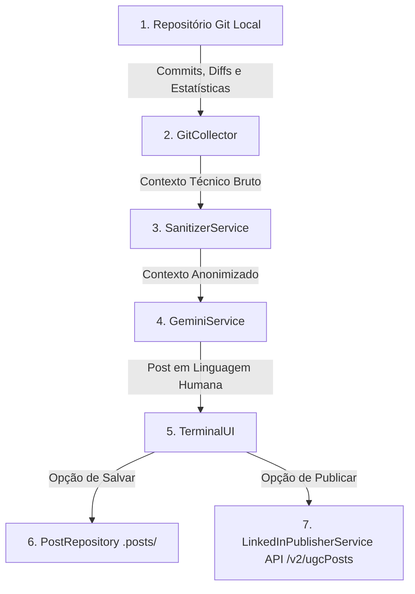

# 🧠 Arquitetura e Funcionamento Interno - DevToLinkedIn CLI

> **Documentação completa da arquitetura do sistema para manutenção e futuros ajustes.**

---

## 📐 1. Visão Geral do Fluxo da Aplicação

O sistema funciona como uma esteira de dados em 6 etapas sequenciais:



---

## 🧩 2. Explicação Detalhada Módulo a Módulo

### 1. Ponto de Entrada CLI (`src/index.ts`)
- **O que faz**: É o arquivo executado quando você digita `npm start` ou `linkedin-logger`.
- **Como funciona**: Utiliza a biblioteca `commander` para parsear argumentos da linha de comando (como a flag `-d` para escolher outro repositório) e inicializa o `TerminalUI`.

---

### 2. Coletor do Git (`src/collectors/git.collector.ts`)
- **O que faz**: Extrai o histórico recente de desenvolvimento do projeto sem você precisar digitar nada.
- **Métodos principais**:
  - `isGitRepository()`: Executa `git rev-parse --is-inside-work-tree` para verificar se o diretório atual é um projeto Git.
  - `collectContext()`: Executa comandos nativos do Git via `child_process.execSync`:
    - `git log --since="00:00:00"` (pega commits do dia).
    - `git diff --name-only` (pega arquivos alterados).
    - `git diff --stat` (estatísticas de linhas adicionadas/removidas).

---

### 3. Motor de Anonimização & Sanitização (`src/sanitizer/sanitizer.service.ts`)
- **O que faz**: Garante a **Zero-Company Policy** e conformidade com NDAs. O que for confidencial é mascarado antes mesmo de ser enviado para a IA.
- **Como funciona**:
  - Lê o arquivo `config.json` e pega a lista `forbiddenWords` (ex: `EmpresaExemplo1`, `EmpresaExemplo2`).
  - Executa substituições com Regex para remover e-mails (`[email-protegido]`), URLs internas (`[url-interna]`) e credenciais (`[credencial-ocultada]`).
  - Substitui nomes de projetos de clientes por expressões neutras fluídas como `sistema-backend`.

---

### 4. Motor de IA & Storytelling (`src/ai/gemini.service.ts`)
- **O que faz**: É o cérebro da aplicação. Transforma os commits brutos em textos altamente didáticos e humanos.
- **Como funciona**:
  1. **Cascata de Modelos**: Tenta primeiro o modelo `gemini-2.0-flash`. Se atingir o limite de requisições gratuitas por minuto (status 429), ele tenta automaticamente `gemini-1.5-flash` ou `gemini-2.0-flash-lite`.
  2. **Configuração de Temperatura (`temperature: 1.0`)**: Força a IA da Google a ser extremamente criativa, garantindo que nenhum post seja igual ao outro.
  3. **Tradutor de Commits (`translateCommitsToHumanNarrative`)**: Pega mensagens brutas de commit (ex: `fix(docker): corrige redes`) e traduz para frases naturais de engenharia (ex: *"Ajuste de containerização no Docker e isolamento de redes entre serviços"*).
  4. **Modo Explicativo Dinâmico**: Se você pedir um post *"maior"*, *"longo"* ou *"detalhado"*, a função detecta a palavra-chave e expande o post para um artigo completo com seções explicativas.

---

### 5. Interface Visual do Terminal (`src/ui/terminal.ui.ts`)
- **O que faz**: Gerencia a experiência do usuário no terminal.
- **Ferramentas utilizadas**:
  - `inquirer`: Exibe menus interativos com setas do teclado.
  - `chalk`: Aplica cores e estilização visual ao texto.
  - `ora`: Exibe animadores de carregamento (spinners).
- **Gerenciamento de Escolhas**: Permite regenerar pedindo instruções à IA, salvar o post localmente em Markdown ou enviá-lo para a API do LinkedIn.

---

### 6. Repositório de Arquivos Locais (`src/storage/post.repository.ts`)
- **O que faz**: Grava uma cópia de segurança de todos os posts gerados.
- **Como funciona**: Cria a pasta `.posts/` (se não existir) e grava arquivos com cabeçalho YAML e timestamp (ex: `post_sistema-backend_2026-07-31_11-30.md`). Sanitiza caracteres especiais do nome para evitar erros no Linux.

---

### 7. Publicador Oficial do LinkedIn (`src/publisher/linkedin.service.ts`)
- **O que faz**: Faz o envio HTTP do post diretamente para os servidores do LinkedIn.
- **Como funciona**:
  - Lê o `LINKEDIN_ACCESS_TOKEN` e o `LINKEDIN_PERSON_URN` (ID exato de autor `iwVxPnsT51`) do arquivo `.env`.
  - Constrói o payload JSON oficial exigido pela rota `POST https://api.linkedin.com/v2/ugcPosts`.
  - Dispara a requisição HTTP com o cabeçalho `X-Restli-Protocol-Version: 2.0.0`.
  - Retorna o ID da publicação e o link direto para o seu feed do LinkedIn.

---

## 🛠️ Guia de Manutenção e Futuros Ajustes

### Se quiser adicionar novas palavras proibidas para anonimização:
Edite o arquivo [config.json](file:///home/vitorgabriel/dev/vitor/linkedin-dev-logger/config.json) e inclua a palavra no array `forbiddenWords`.

### Se quiser mudar o tom de voz padrão da IA:
Edite a função `buildPrompt()` no arquivo [src/ai/gemini.service.ts](file:///home/vitorgabriel/dev/vitor/linkedin-dev-logger/src/ai/gemini.service.ts) ajustando as instruções de regras de estilo.

### Se quiser recompilar o projeto após alterar o código:
Sempre que fizer uma modificação no código TypeScript dentro da pasta `src/`, rode no terminal:
```bash
npm run build
```
